---
## Front matter
title: "Отчет по лабораторной работе №1"
subtitle: "Дисциплина: операционные системы"
author: "Пронякова Ольга Максимовна"

## Generic otions
lang: ru-RU
toc-title: "Содержание"

## Bibliography
bibliography: bib/cite.bib
csl: pandoc/csl/gost-r-7-0-5-2008-numeric.csl

## Pdf output format
toc: true # Table of contents
toc-depth: 2
lof: true # List of figures
lot: true # List of tables
fontsize: 12pt
linestretch: 1.5
papersize: a4
documentclass: scrreprt
## I18n polyglossia
polyglossia-lang:
  name: russian
  options:
	- spelling=modern
	- babelshorthands=true
polyglossia-otherlangs:
  name: english
## I18n babel
babel-lang: russian
babel-otherlangs: english
## Fonts
mainfont: PT Serif
romanfont: PT Serif
sansfont: PT Sans
monofont: PT Mono
mainfontoptions: Ligatures=TeX
romanfontoptions: Ligatures=TeX
sansfontoptions: Ligatures=TeX,Scale=MatchLowercase
monofontoptions: Scale=MatchLowercase,Scale=0.9
## Biblatex
biblatex: true
biblio-style: "gost-numeric"
biblatexoptions:
  - parentracker=true
  - backend=biber
  - hyperref=auto
  - language=auto
  - autolang=other*
  - citestyle=gost-numeric
## Pandoc-crossref LaTeX customization
figureTitle: "Рис."
tableTitle: "Таблица"
listingTitle: "Листинг"
lofTitle: "Список иллюстраций"
lotTitle: "Список таблиц"
lolTitle: "Листинги"
## Misc options
indent: true
header-includes:
  - \usepackage{indentfirst}
  - \usepackage{float} # keep figures where there are in the text
  - \floatplacement{figure}{H} # keep figures where there are in the text
---

# Цель работы

Целью данной работы является приобретение практических навыков установки
операционной системы на виртуальную машину, настройки минимально необходимых
для дальнейшей работы сервисов.

# Задание

Установка и конфигурация операционной системы на виртуальную машину.
Установить на виртуальную машину VirtualBox операционную систему Linux.

# Теоретическое введение

## Введение в GNU Linux

Операционная система (ОС) — это комплекс взаимосвязанных программ,
предназначенных для управления ресурсами компьютера и организации
взаимодействия с пользователем. Сегодня наиболее известными операционными
системами являются ОС семейства Microsoft Windows и UNIX-подобные системы.
GNU Linux — семейство переносимых, многозадачных и многопользовательских
операционных систем, на базе ядра Linux, включающих тот или иной набор утилит и
программ проекта GNU, и, возможно, другие компоненты. Как и ядро Linux, системы
на его основе, как правило, создаются и распространяются в соответствии с моделью
разработки свободного и открытого программного обеспечения (Open-Source Software).
Linux-системы распространяются в основном бесплатно в виде различных
дистрибутивов.
Дистрибутив GNU Linux — общее определение ОС, использующих ядро Linux и
набор библиотек и утилит, выпускаемых в рамках проекта GNU, а также графическую
оконную подсистему X Window System. Дистрибутив готов для конечной установки на
пользовательское оборудование. Кроме ядра и, собственно, операционной системы
дистрибутивы обычно содержат широкий набор приложений, таких как редакторы
документов и таблиц, мультимедийные проигрыватели, системы для работы с базами
данных и т.д. Существуют дистрибутивы, разрабатываемые как при коммерческой
поддержке (Red Hat / Fedora, SLED / OpenSUSE, Ubuntu), так и исключительно
усилиями добровольцев (Debian, Slackware, Gentoo, ArchLinux).

## Введение в командную строку GNU Linux

Работу ОС GNU Linux можно представить в виде функционирования множества
взаимосвязанных процессов. При загрузке системы сначала запускается ядро, которое,
в свою очередь, запускает оболочку ОС (от англ. shell «оболочка»). Взаимодействие
пользователя с системой Linux (работа с данными и управление работающими в
системе процессами) происходит в интерактивном режиме посредством командного
языка. Оболочка операционной системы (или командная оболочка, интерпретатор
команд) — интерпретирует (т.е. переводит на машинный язык) вводимые
пользователем команды, запускает соответствующие программы (процессы),
формирует и выводит ответные сообщения. Кроме того, на языке командной оболочки
можно писать небольшие программы для выполнения ряда последовательных
операций с файлами и содержащимися в них данными — сценарии (скрипты).
Из командных оболочек GNU Linux наиболее популярны bash, csh, ksh, zsh. Команда
echo $SHELL позволяет проверить, какая оболочка используется. В качестве
предустановленной командной оболочки GNU Linux используется одна из наиболее
распространённых разновидностей командной оболочки — bash (Bourne again shell).
В GNU Linux доступ пользователя к командной оболочке обеспечивается через
терминал (или консоль). Запуск терминала можно осуществить через главное меню
Приложения Стандартные Терминал (или Консоль) или нажав Ctrl + Alt + t . Интерфейс
командной оболочки очень прост. Обычно он состоит из приглашения командной
строки (строки, оканчивающейся символом $), по которому пользователь вводит
команды:
iivanova@dk4n31:~$
Это приглашение командной оболочки, которое несёт в себе информацию об имени
пользователя iivanova, имени компьютера dk4n31 и текущем каталоге, в котором
находится пользователь, в данном случае это домашний каталог пользователя,
обозначенный как ~).
Команды могут быть использованы с ключами (или опциями) — указаниями,
модифицирующими поведение команды. Ключи обычно начинаются с символа (-) или
(--) и часто состоят из одной буквы. Кроме ключей после команды могут быть
использованы аргументы (параметры) — названия объектов, для которых нужно
выполнить команду (например, имена файлов и каталогов). Например, для подробного
просмотра содержимого каталога documents может быть использована команда ls с
ключом -l: iivanova@dk4n31:
~$ ls -l documents
В данном случае ls – это имя команды, l – ключ, documents – аргумент. Команды,
ключи и аргументы должны быть отделены друг от друга пробелом.
Ввод команды завершается нажатием клавиши Enter , после чего команда передаётся
оболочке на исполнение. Результатом выполнения команды могут являться сообщения
о ходе выполнения команды или об ошибках. Появление приглашения командной
строки говорит о том, что выполнение команды завершено.
Иногда в GNU Linux имена программ и команд слишком длинные, однако bash
может завершать имена при их вводе в терминале. Нажав клавишу Tab , можно
завершить имя команды, программы или каталога. Например, предположим, что нужно
использовать программу mcedit. Для этого наберите в командной строке mc, затем
нажмите один раз клавишу Tab . Если ничего не происходит, то это означает, что
существует несколько возможных вариантов завершения команды. Нажав клавишу Tab
ещё раз, можно получить список имён, начинающихся с mc: iivanova@dk4n31:~$ mc
mc mcd mcedit mclasserase mcookie mcview
mcat mcdiff mcheck mcomp mcopy
iivanova@dk4n31:~$ mc

# Выполнение лабораторной работы

## Настройка VirtualBox

Загрузила в дисплейном классе операционную систему Linux. Вошла в систему.
Запустила терминал (через главное меню Приложения Стандартные Терминал (или
Консоль) или нажав Ctrl + Alt + t ) и перешла в каталог /var/tmp cd /var/tmp Создала
каталог с моим именем пользователя.
Проверила в свойствах VirtualBox месторасположение каталога для виртуальных
машин. Для этого в VirtualBox выбрала Файл Свойства , вкладка Общие.
Также сменила комбинацию для хост-клавиши, которая используется для
освобождения курсора мыши, который может захватить виртуальная машина. Файл
Свойства , вкладка Ввод Виртуальная машина.
Создала новую виртуальную машину. Для этого в VirtualBox выбрала Машина
Создать . Указала имя виртуальной машины (мой логин в дисплейном классе), тип
операционной системы – Linux, Ubuntu(рис.1 [-@fig:pic1]).

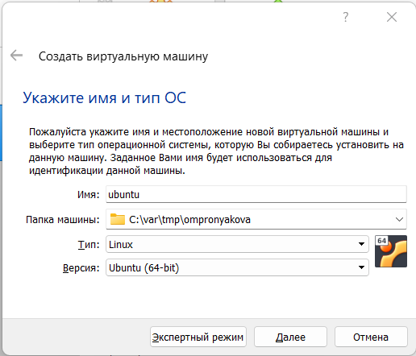{ #fig:pic1 width=100% }

Указала размер основной памяти виртуальной машины – 2048 МБ.
Задала конфигурацию жёсткого диска – загрузочный, VDI (BirtualBox Disk Image), динамический виртуальный диск.
Задала размер диска – 80 ГБ, его расположение – в данном случае
/var/tmp/ompronyakova/ubuntu.vdi
В настройках виртуальной машины во вкладке Дисплей Экран увеличила
доступный объем видеопамяти до 128 МБ(рис.2 [-@fig:pic2]).

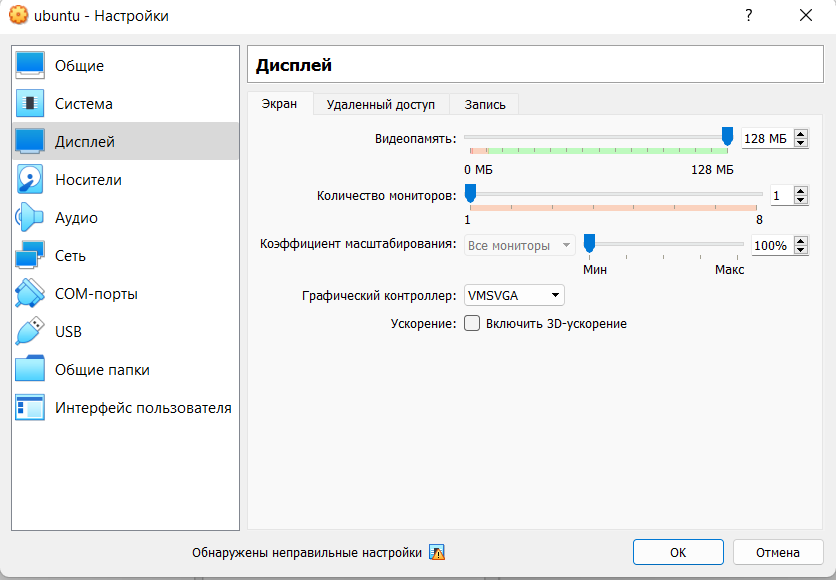{ #fig:pic2 width=100% }

В настройках виртуальной машины во вкладке Носители добавила новый
привод оптических дисков(рис.3 [-@fig:pic3]).

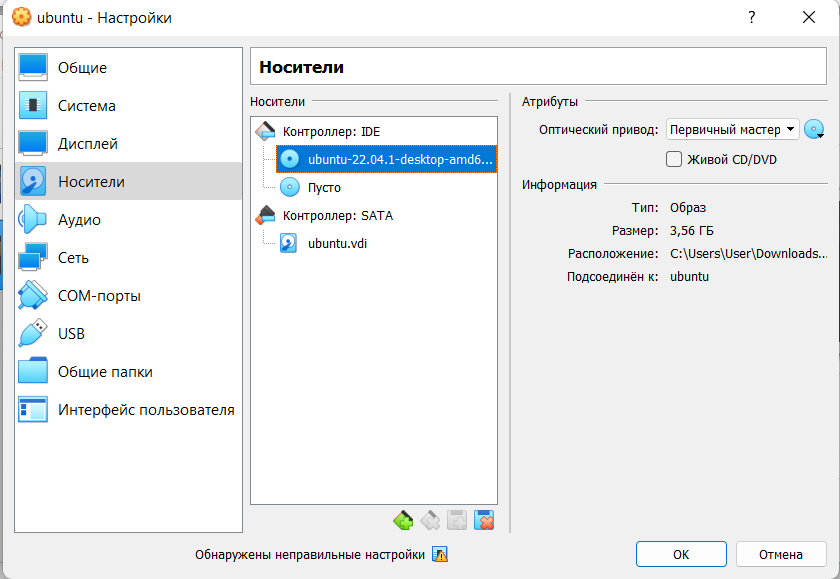{ #fig:pic3 width=100% }

При установке на собственную технику использовала скачанный образ
операционной системы Ubuntu:

[3. Cкачанный образ операционной системы Ubuntu](https://ubuntu.com/download/desktop)

## Запуск виртуальной машины и установка системы

Запустила виртуальную машину (Машина Запустить ). После загрузки с
виртуального оптического диска я увидела окно с двумя вариантами и выбрала
установить Ubuntu(рис.4 [-@fig:pic4]).

{ #fig:pic4 width=100% }

Выбрала язык и скорректировала часовой пояс (рис.5 [-@fig:pic5]). Место установки ОС
оставила без изменения. Далее «Тип установки» выбрала «Стереть диск и установить
Ubuntu»).

{ #fig:pic5 width=100% }

Затем нужно было зарегистрироваться(рис.6 [-@fig:pic6]).

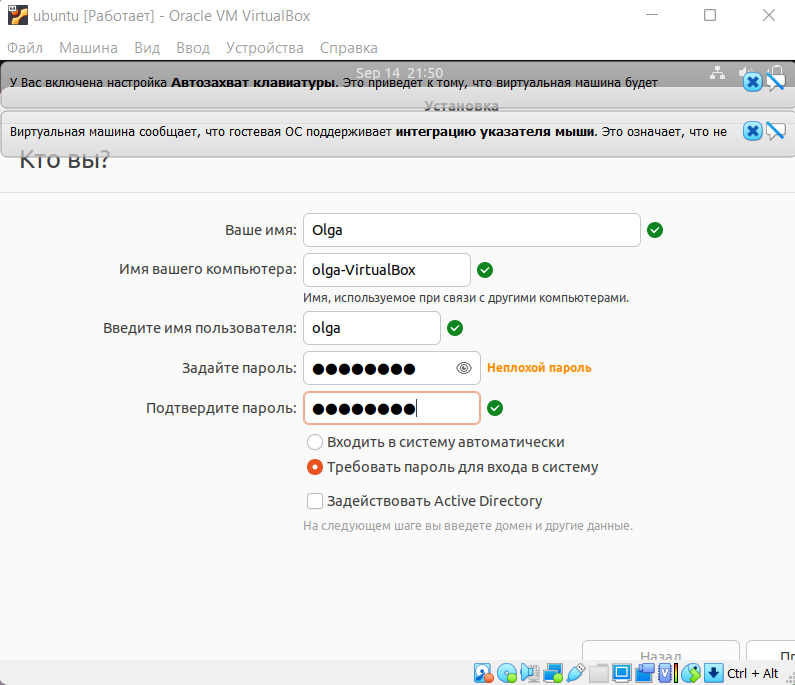{ #fig:pic6 width=100% }

Затем началась установка Ubuntu. После установки требовалось подтвердить
подлинность и ввести пароль, который создавался мною ранее(рис.7 [-@fig:pic7]).

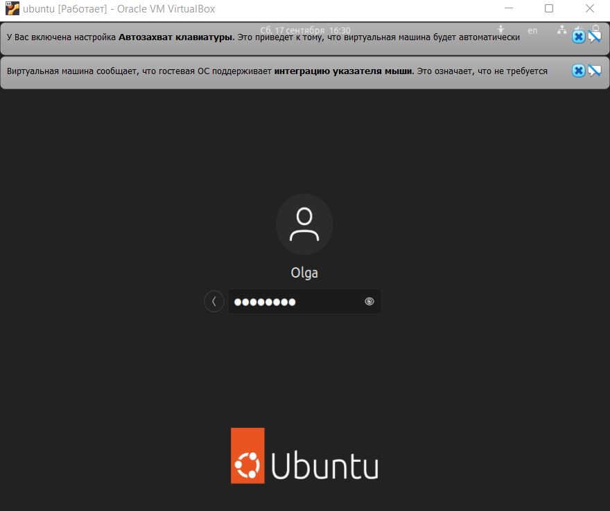{ #fig:pic7 width=100% }

## Завершение установки

После окончания установки закрыла окно установщика и выключила систему(рис.8 [-@fig:pic8]).

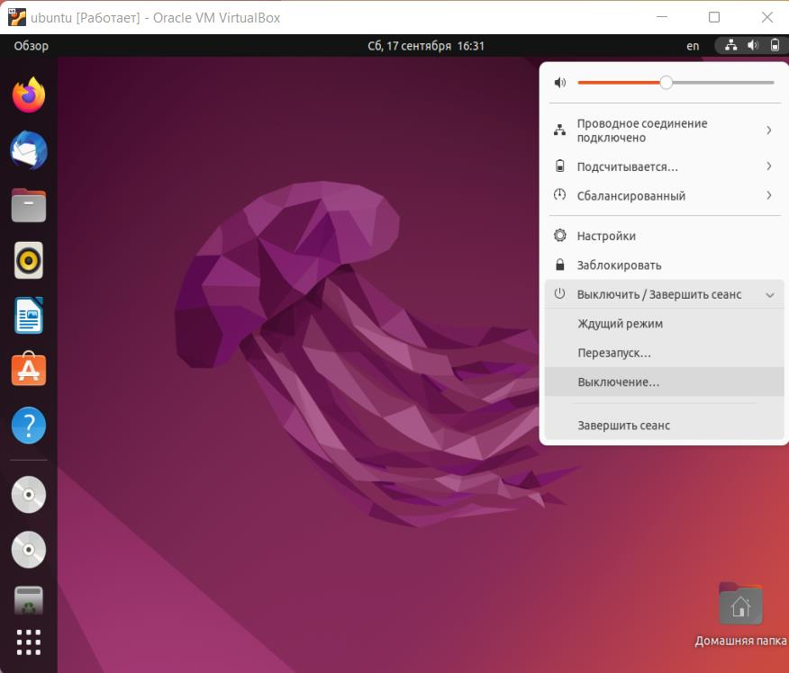{ #fig:pic8 width=100% }

После того, как виртуальная машина отключилась, следовало изъять образ диска
из дисковода. Нажала на значок диска и выбрала пункт изъять. После извлечения в
дисководе стало пусто(рис.9 [-@fig:pic9]).

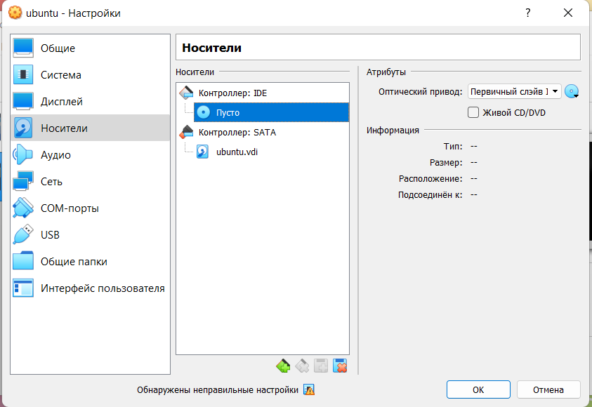{ #fig:pic9 width=100% }

# Задания для самостоятельной работы

1. Запустила установленную в VirtualBox ОС
2. Нашла в меню приложений и запустите браузер Firefox. Все хорошо
открывается(рис.10 [-@fig:pic10]).

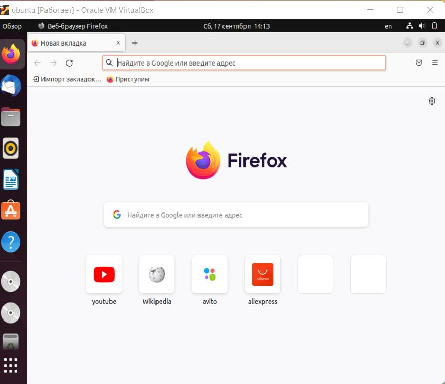{ #fig:pic10 width=100% }

3. Запустила терминал (консоль).
4. Установила основное программное обеспечение необходимое для дальнейшей
работы. Программы, которые я вводила:
 1)Midninght Commander (mc): :~$ sudo apt install mc(рис.11 [-@fig:pic11]).
 2)Git: ~$ sudo apt install git(рис.12 [-@fig:pic12]).
 3)Nasm (Netwide Assembler): ~$ sudo apt install nasm(рис.13 [-@fig:pic13]).
 
 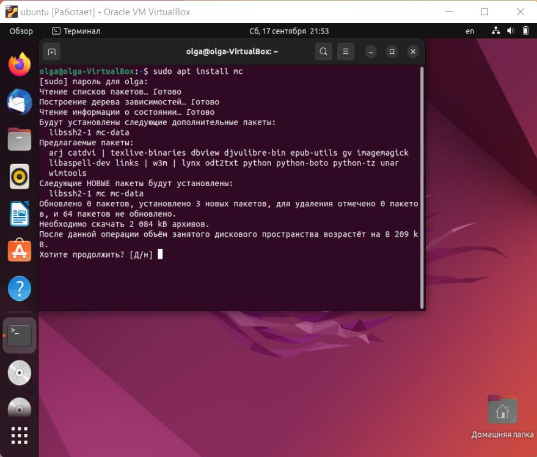{ #fig:pic11 width=100% }
 
 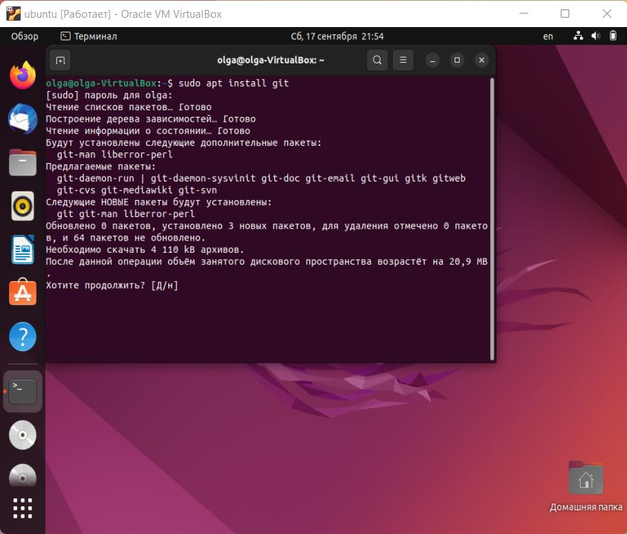{ #fig:pic12 width=100% }
 
 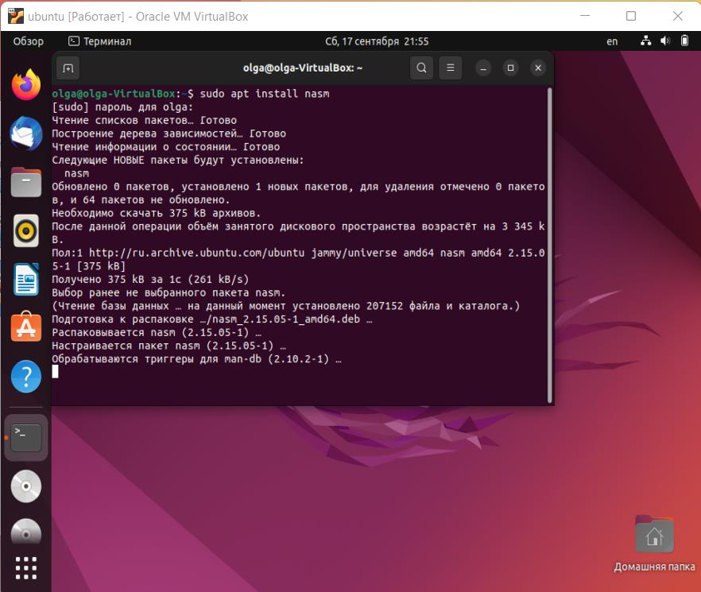{ #fig:pic13 width=100% }

# Выводы

В ходе данной лабораторной работы я приобрела практические навыки
установки операционной системы на виртуальную машину, настройки минимально
необходимых для дальнейшей работы сервисов.

# Список литературы{.unnumbered}

[1. Архитектура ЭВМ](https://esystem.rudn.ru/pluginfile.php/1584622/mod_resource/content/1/Лабораторная%20работа%20№3.pdf)

[2. Youtube(Как установить Ubuntu на VirtualBox)](https://www.youtube.com/watch?v=jF59zYTVbZE&t=1s)

::: {#refs}
:::
