---
## Front matter
title: "Отчёта по лабораторной работе №3"
subtitle: "Дисциплина: Архитектурв комптютерв"
author: "Пронякова Ольга Максимовна"

## Generic otions
lang: ru-RU
toc-title: "Содержание"

## Bibliography
bibliography: bib/cite.bib
csl: pandoc/csl/gost-r-7-0-5-2008-numeric.csl

## Pdf output format
toc: true # Table of contents
toc-depth: 2
lof: true # List of figures
lot: true # List of tables
fontsize: 12pt
linestretch: 1.5
papersize: a4
documentclass: scrreprt
## I18n polyglossia
polyglossia-lang:
  name: russian
  options:
	- spelling=modern
	- babelshorthands=true
polyglossia-otherlangs:
  name: english
## I18n babel
babel-lang: russian
babel-otherlangs: english
## Fonts
mainfont: PT Serif
romanfont: PT Serif
sansfont: PT Sans
monofont: PT Mono
mainfontoptions: Ligatures=TeX
romanfontoptions: Ligatures=TeX
sansfontoptions: Ligatures=TeX,Scale=MatchLowercase
monofontoptions: Scale=MatchLowercase,Scale=0.9
## Biblatex
biblatex: true
biblio-style: "gost-numeric"
biblatexoptions:
  - parentracker=true
  - backend=biber
  - hyperref=auto
  - language=auto
  - autolang=other*
  - citestyle=gost-numeric
## Pandoc-crossref LaTeX customization
figureTitle: "Рис."
tableTitle: "Таблица"
listingTitle: "Листинг"
lofTitle: "Список иллюстраций"
lotTitle: "Список таблиц"
lolTitle: "Листинги"
## Misc options
indent: true
header-includes:
  - \usepackage{indentfirst}
  - \usepackage{float} # keep figures where there are in the text
  - \floatplacement{figure}{H} # keep figures where there are in the text
---

# Цель работы

Целью работы является изучить идеологию и применение средств контроля
версий. Приобрести практические навыки по работе с системой git.

# Выполнение лабораторной работы

Создаем учётную запись на сайте https://github.com/ и заполните основные данные. (рис. [-@fig:pic1])

{ #fig:pic1 width=100% }

Сначала сделаем предварительную конфигурацию git. Открываем терминал и
вводим следующие команды, указав имя и email владельца репозитория (рис. [-@fig:pic2]).

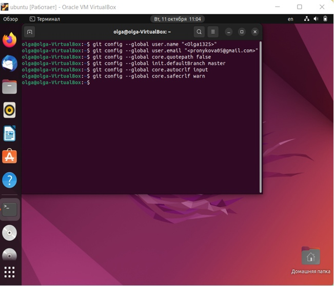{ #fig:pic2 width=100% }

Для последующей идентификации пользователя на сервере репозиториев
необходимо сгенерировать пару ключей (приватный и открытый) (рис. [-@fig:pic3]).

{ #fig:pic3 width=100% }

Далее необходимо загрузить сгенерённый открытый ключ. Для этого заходим на
сайт http://github.org/ под своей учётной записью и переходим в меню Setting . После
этого выбирвем в боковом меню SSH and GPG keys и нажимаем кнопку New SSH key .
Скопировав из локальной консоли ключ в буфер обмена (рис. [-@fig:pic4])
И (рис. [-@fig:pic5]).

{ #fig:pic4 width=100% }

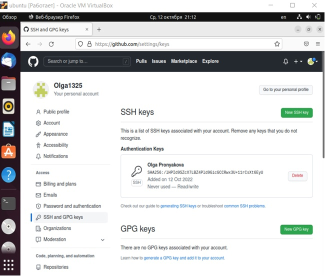{ #fig:pic5 width=100% }

Открываем терминал и создаем каталог для предмета «Архитектура компьютера»
(рис. [-@fig:pic6]).

{ #fig:pic6 width=100% }

Перейдем на станицу репозитория с шаблоном курса https://github.com/yam
adharma/course-directory-student-template. Далее выбираем Use this template. В
открывшемся окне задаем имя репозитория (Repository name) study_2022–2023_arh-pc
и создаем репозиторий (рис. [-@fig:pic7]).

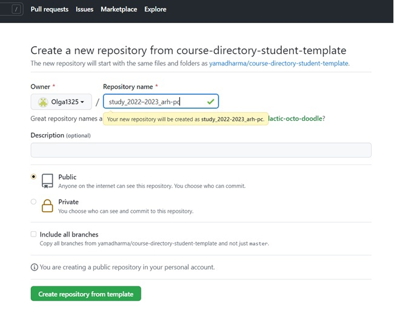{ #fig:pic7 width=100% }

Открываем терминал и переходим в каталог курса. Клонируем созданный
репозиторий (рис. [-@fig:pic8]) (рис. [-@fig:pic9]).

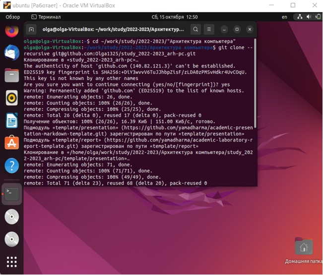{ #fig:pic8 width=100% }

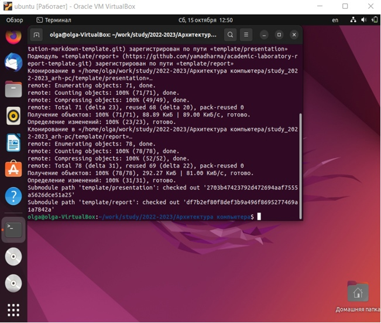{ #fig:pic9 width=100% }

Перейдем в каталог курса, удалим лишние файлы и создадим необходимые
каталоги (рис. [-@fig:pic10]) (рис. [-@fig:pic11]).

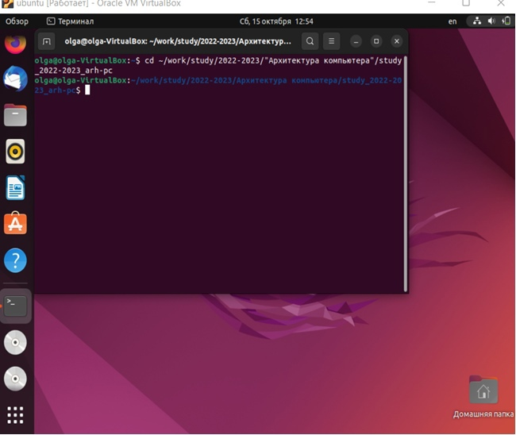{ #fig:pic10 width=100% }

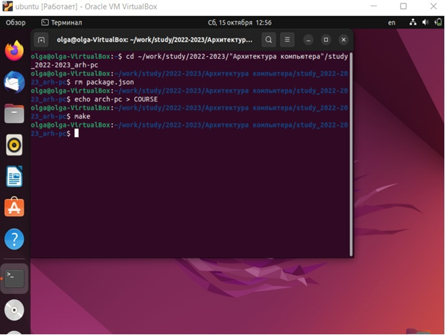{ #fig:pic11 width=100% }

Отправляем файлы на сервер (рис. [-@fig:pic12]) (рис.[-@fig:pic13])(рис. [-@fig:pic14]) (рис. [-@fig:pic15]) (рис. [-@fig:pic16]).

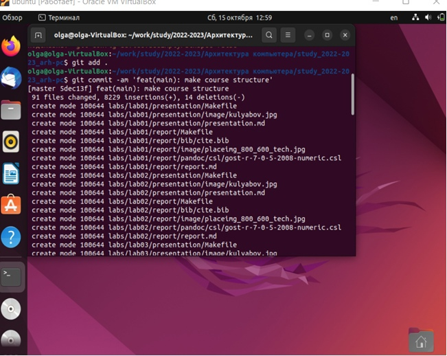{ #fig:pic12 width=100% }

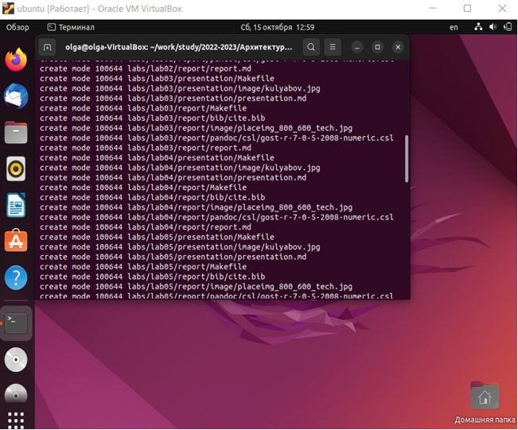{ #fig:pic13 width=100% }

{ #fig:pic14 width=100% }

{ #fig:pic15 width=100% }

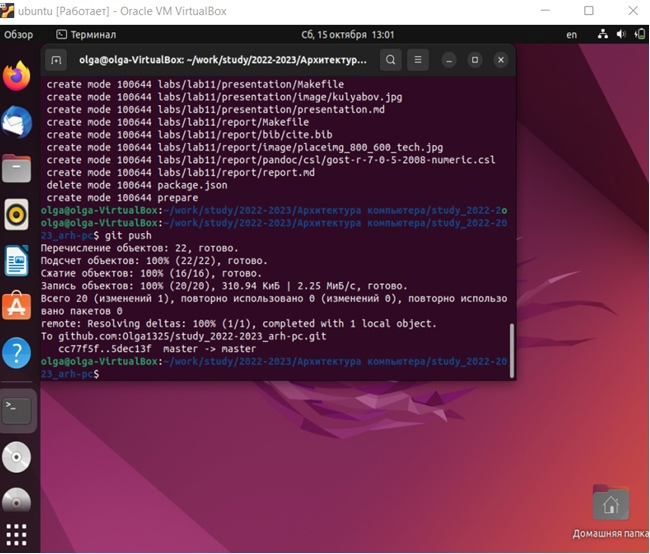{ #fig:pic16 width=100% }

Задания для самостоятельной работы

1. Для того, чтобы создать отчет по выполнению лабораторной работы в
соответствующем каталоге рабочего пространства, необходимо перейти в директорию
и создать файл (рис. [-@fig:pic17]) (рис. [-@fig:pic18]).

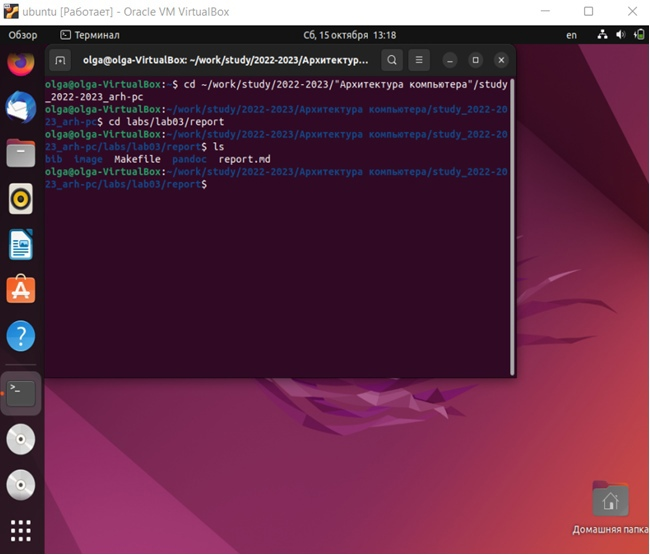{ #fig:pic17 width=100% }

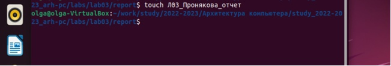{ #fig:pic18 width=100% }

Проверим наличие файла через текстовый редактор (рис. [-@fig:pic19]).

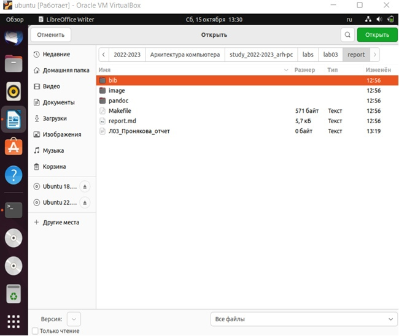{ #fig:pic19 width=100% }

2-3. Скопируем отчеты по выполнению предыдущих лабораторных работ в
соответствующие каталоги созданного рабочего пространства и загрузим их на github
(рис. [-@fig:pic20]) (рис. [-@fig:pic21]).

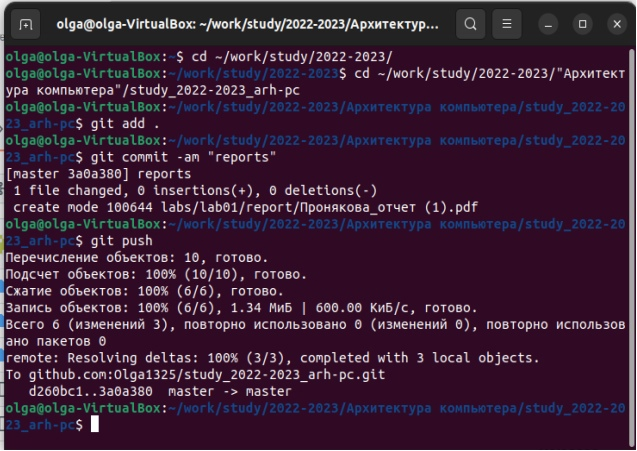{ #fig:pic20 width=100% }

{ #fig:pic21 width=100% }

Выполним проверку. Откроем github и посмотрим, загрузились ли туда наши
файлы (рис. [-@fig:pic22]) (рис. [-@fig:pic23]).

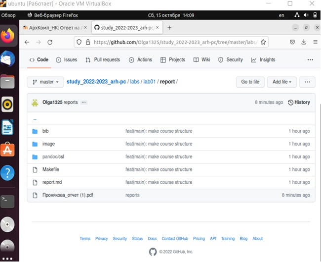{ #fig:pic22 width=100% }

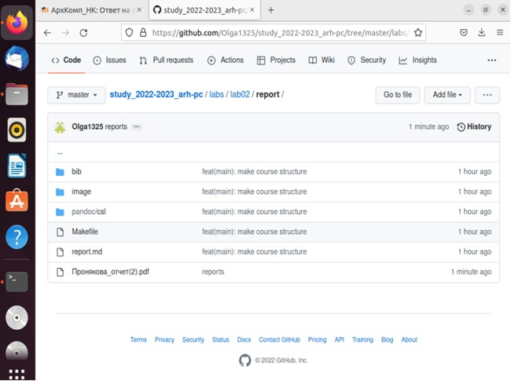{ #fig:pic23 width=100% }

Далее таким же способом загружаем отчет по лабораторной работе №3.

# Выводы

Изучила идеологию и применение средств контроля версий. Приобрела практические навыки по работе с системой git.

# Список литературы{.unnumbered}

[1. Архитектура ЭВМ](https://esystem.rudn.ru/pluginfile.php/1584622/mod_resource/content/1/Лабораторная%20работа%20№3.pdf)

::: {#refs}
:::
