---
## Front matter
title: "Шаблон отчёта по лабораторной работе №4"
subtitle: "Дисциплина: архитектура компьютера"
author: "Пронякова Ольга Максимовна"

## Generic otions
lang: ru-RU
toc-title: "Содержание"

## Bibliography
bibliography: bib/cite.bib
csl: pandoc/csl/gost-r-7-0-5-2008-numeric.csl

## Pdf output format
toc: true # Table of contents
toc-depth: 2
lof: true # List of figures
lot: true # List of tables
fontsize: 12pt
linestretch: 1.5
papersize: a4
documentclass: scrreprt
## I18n polyglossia
polyglossia-lang:
  name: russian
  options:
	- spelling=modern
	- babelshorthands=true
polyglossia-otherlangs:
  name: english
## I18n babel
babel-lang: russian
babel-otherlangs: english
## Fonts
mainfont: PT Serif
romanfont: PT Serif
sansfont: PT Sans
monofont: PT Mono
mainfontoptions: Ligatures=TeX
romanfontoptions: Ligatures=TeX
sansfontoptions: Ligatures=TeX,Scale=MatchLowercase
monofontoptions: Scale=MatchLowercase,Scale=0.9
## Biblatex
biblatex: true
biblio-style: "gost-numeric"
biblatexoptions:
  - parentracker=true
  - backend=biber
  - hyperref=auto
  - language=auto
  - autolang=other*
  - citestyle=gost-numeric
## Pandoc-crossref LaTeX customization
figureTitle: "Рис."
tableTitle: "Таблица"
listingTitle: "Листинг"
lofTitle: "Список иллюстраций"
lotTitle: "Список таблиц"
lolTitle: "Листинги"
## Misc options
indent: true
header-includes:
  - \usepackage{indentfirst}
  - \usepackage{float} # keep figures where there are in the text
  - \floatplacement{figure}{H} # keep figures where there are in the text
---

# Цель работы

Целью данной лабораторной работы является освоение процедуры оформления отчета с помощью легковесного языка разметки Markdown.

# Задание

1. Установка необходимого ПО
2. Запонение отчета по выполнению лабораторной работы №4 с помощью языка разметки Markdown
3. Задание для самостоятельной работы

# Теоретическое введение

Markdown — облегчённый язык разметки, созданный с целью обозначения форматирования в простом тексте, с максимальным сохранением его читаемости человеком, и пригодный для машинного преобразования в языки для продвинутых публикаций.

# Выполнение лабораторной работы

## Установление необходимого ПО
Установка TexLive
На странице официального сайта TeX Live https://www.tug.org/texlive/acqu
ire-netinstall.html скачиваю архив install-tl-unx.tar.gz (рис. [-@fig:pic1]).

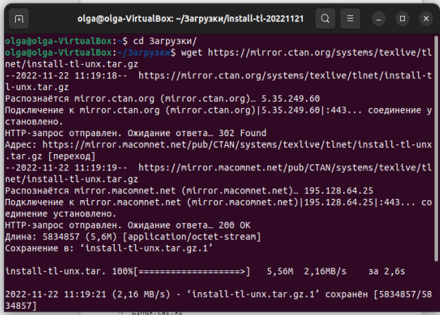{ #fig:pic1 width=100% }

Распаковываю архив и перехожу в распакованную папку с помощью cd. Запускаю скрипт install-tl-* с правами root, используя sudo в начале команды(рис. [-@fig:pic2]) (рис. [-@fig:pic3]).

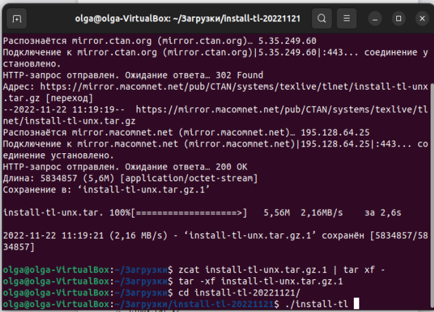{ #fig:pic2 width=100% }

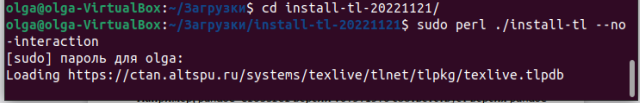{ #fig:pic3 width=100% }

Добавляю /usr/local/texlive/2022/bin/x86_64-linux в свой PATH для текущей и будущих сессий (рис. [-@fig:pic4]).

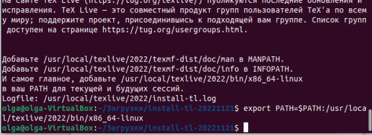{ #fig:pic4 width=100% }

## Установка pandoc и pandoc-crossref
Скачиваю архив pandoc версии 2.19.2 (рис. [-@fig:pic5]).

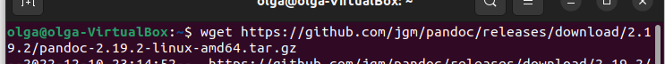{ #fig:pic5 width=100% }

Скачиваю архив pandoc-crossref и распаковываю его (рис. [-@fig:pic6]) (рис. [-@fig:pic7]).

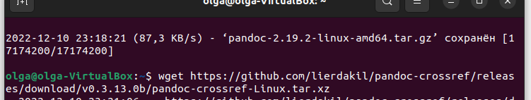{ #fig:pic6 width=100% }

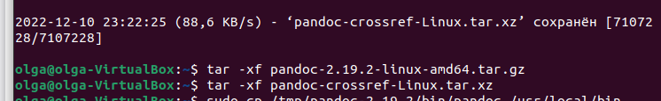{ #fig:pic7 width=100% }

Копирую файлы pandoc и pandoc-crossref в каталог /usr/local/bin/ с правами пользователя root с помощью sudo (рис. [-@fig:pic8]).

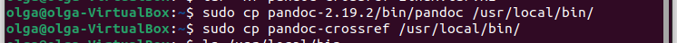{ #fig:pic8 width=100% }

Проверяю корректность выполненных действий (рис. [-@fig:pic9]).

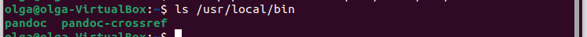{ #fig:pic9 width=100% }

## Заполнение отчета по выполнению лабораторной работы №4 с помощтю языка разметки Markdown
Открываю терминал и перехожу в каталог, сформированный при выполнении прошлой лабораторной работы. Обновляю локальный репозиторий, скачав изменения из удаленного репозитория с помощью команды git pull (рис. [-@fig:pic10]).

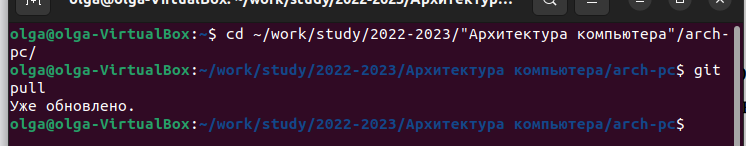{ #fig:pic10 width=100% }

Перехожу в каталог с шаблоном отчета по лабораторной работе №4 с помощью cd (рис. [-@fig:pic11]).

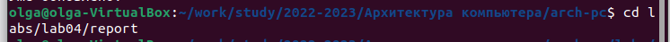{ #fig:pic11 width=100% }

Компилирую шаблон с использованием Makefile, вводя команду make (рис. [-@fig:pic12]).

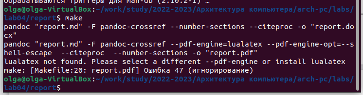{ #fig:pic12 width=100% }

Сгенерировались файл report.docx и report.pdf (рис. [-@fig:pic13]).

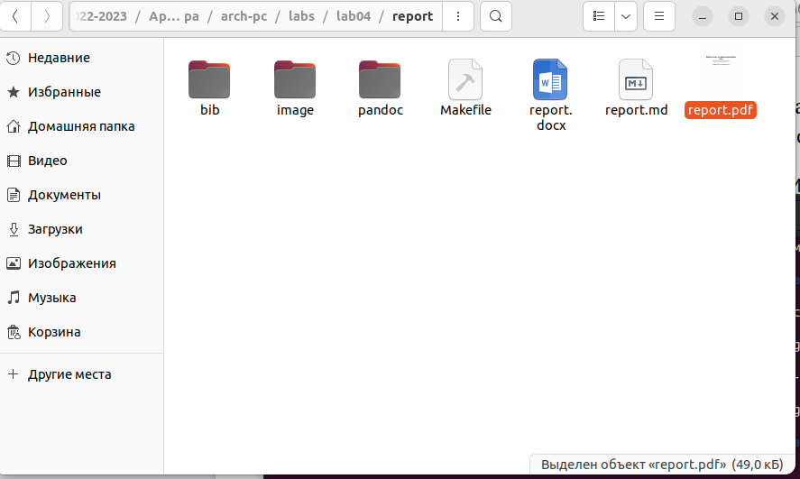{ #fig:pic13 width=100% }

После открытия данных файлов убедилась, что все правильно сгенерировалось. Затем удаляю полученные файлы с использованием Makefile, вводя команду make clean. С помощью команды ls проверяю, удалились ли файлы (рис. [-@fig:pic14]) (рис. [-@fig:pic15]).

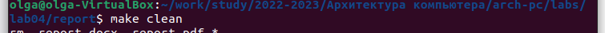{ #fig:pic14 width=100% }

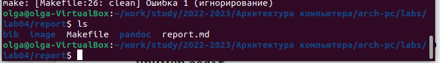{ #fig:pic15 width=100% }

Открываю файл report.md с помощью gedit и начинаю заполнять отчет (рис. [-@fig:pic16]).

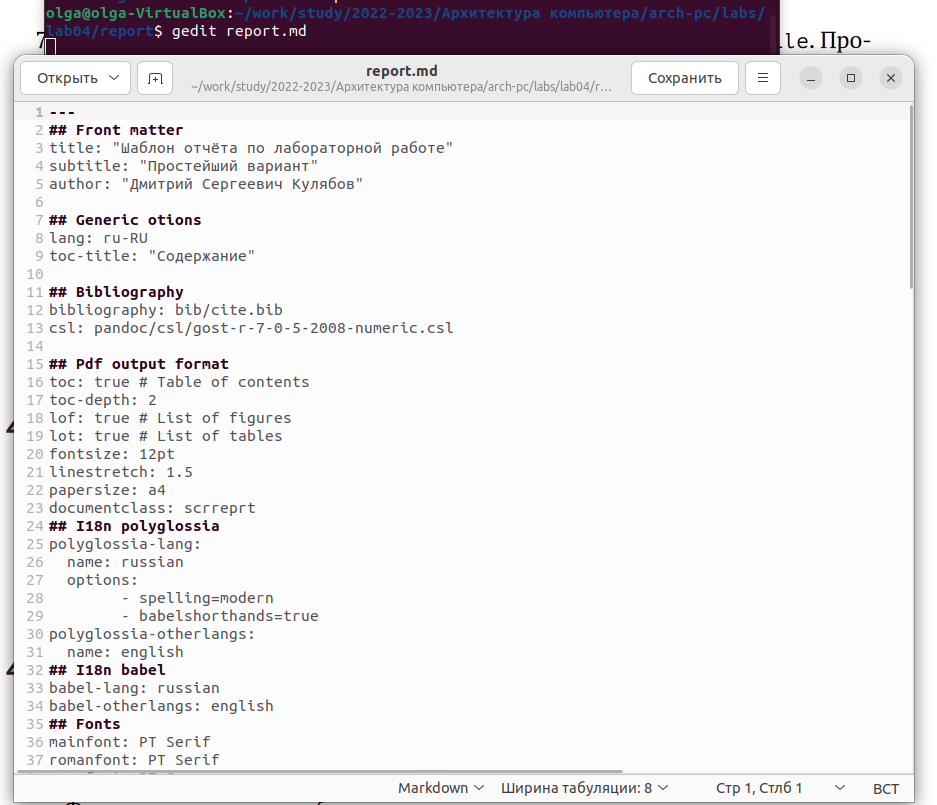{ #fig:pic16 width=100% }

Компилирую файл с отчетом и загружаю на Github.

# Задание для самостоятельной работы
Перехожу в директорию lab03/report с помощью cd, чтобы там заполнить отчет по третьей лабораторной работе. Открываю файл с помощью gedit и заполняю отчет. Добавляю файл на Github с помощью команды git add и сохраняю их с помощью commit. Отправляю файлы на сервер с помощью команды git pull. Проверяю наличие на Github (рис. [-@fig:pic17]).

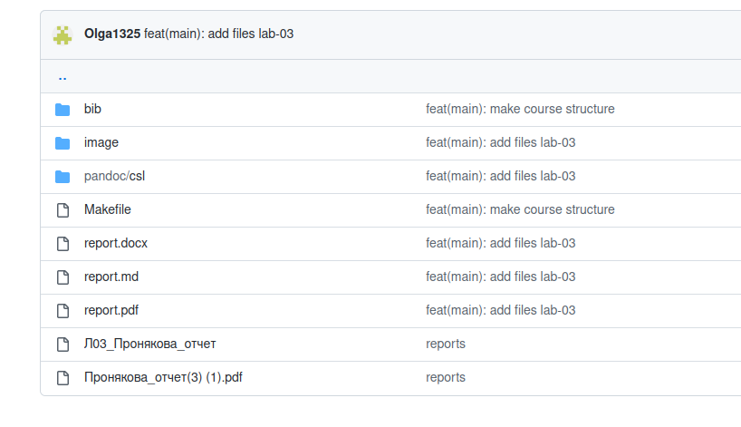{ #fig:pic17 width=100% }

# Выводы

Освоила процедуры оформления отчетов с помощью легковесного языка разметки Markfown.

# Список литературы{.unnumbered}

[1. Архитектура ЭВМ](https://esystem.rudn.ru/pluginfile.php/1584622/mod_resource/content/1/Лабораторная%20работа%20№3.pdf)

::: {#refs}
:::
