---
## Front matter
title: "Шаблон отчёта по лабораторной работе №5"
subtitle: "Дисциплина: архитектура компьютера"
author: "Пронякова Ольга Максимовна"

## Generic otions
lang: ru-RU
toc-title: "Содержание"

## Bibliography
bibliography: bib/cite.bib
csl: pandoc/csl/gost-r-7-0-5-2008-numeric.csl

## Pdf output format
toc: true # Table of contents
toc-depth: 2
lof: true # List of figures
lot: true # List of tables
fontsize: 12pt
linestretch: 1.5
papersize: a4
documentclass: scrreprt
## I18n polyglossia
polyglossia-lang:
  name: russian
  options:
	- spelling=modern
	- babelshorthands=true
polyglossia-otherlangs:
  name: english
## I18n babel
babel-lang: russian
babel-otherlangs: english
## Fonts
mainfont: PT Serif
romanfont: PT Serif
sansfont: PT Sans
monofont: PT Mono
mainfontoptions: Ligatures=TeX
romanfontoptions: Ligatures=TeX
sansfontoptions: Ligatures=TeX,Scale=MatchLowercase
monofontoptions: Scale=MatchLowercase,Scale=0.9
## Biblatex
biblatex: true
biblio-style: "gost-numeric"
biblatexoptions:
  - parentracker=true
  - backend=biber
  - hyperref=auto
  - language=auto
  - autolang=other*
  - citestyle=gost-numeric
## Pandoc-crossref LaTeX customization
figureTitle: "Рис."
tableTitle: "Таблица"
listingTitle: "Листинг"
lofTitle: "Список иллюстраций"
lotTitle: "Список таблиц"
lolTitle: "Листинги"
## Misc options
indent: true
header-includes:
  - \usepackage{indentfirst}
  - \usepackage{float} # keep figures where there are in the text
  - \floatplacement{figure}{H} # keep figures where there are in the text
---

# Цель работы

Освоение процедуры компиляции и сборки программ, написанных на ассем-
блере NASM.

# Задание

1. Создание программы Hello world!
2. Работа с транслятором NASM
3. Работа с расширенным синтаксисом командной строки NASM
4. работа с компоновщиком LD
5. Запуск исполняемого файла
6. Выполнение заданий для самостоятельной работы

# Теоретическое введение

Основными функциональными элементами любой электронно-вычислительной
машины (ЭВМ) являются центральный процессор, память и периферийные
устройства.
Взаимодействие этих устройств осуществляется через общую шину, к которой
они подключены. Физически шина представляет собой большое количество про-
водников, соединяющих устройства друг с другом. В современных компьютерах
проводники выполнены в виде электропроводящих дорожек на материнской
(системной) плате.
Основной задачей процессора является обработка информации, а также орга-
низация координации всех узлов компьютера. В состав центрального процес-
сора (ЦП) входят следующие устройства:
• арифметико-логическое устройство (АЛУ) — выполняет логические
и арифметические действия, необходимые для обработки информации,
хранящейся в памяти;
• устройство управления (УУ) — обеспечивает управление и контроль всех
устройств компьютера;
• регистры — сверхбыстрая оперативная память небольшого объёма, вхо-
дящая в состав процессора, для временного хранения промежуточных результатов выполнения инструкций; регистры процессора делятся на два
типа: регистры общего назначения и специальные регистры.
Для того, чтобы писать программы на ассемблере, необходимо знать, какие
регистры процессора существуют и как их можно использовать. Большинство
команд в программах написанных на ассемблере используют регистры в каче-
стве операндов. Практически все команды представляют собой преобразование
данных хранящихся в регистрах процессора, это например пересылка данных
между регистрами или между регистрами и памятью, преобразование (арифме-
тические или логические операции) данных хранящихся в регистрах.
Доступ к регистрам осуществляется не по адресам, как к основной памяти, а
по именам. Каждый регистр процессора архитектуры x86 имеет свое название,
состоящее из 2 или 3 букв латинского алфавита.
В качестве примера приведем названия основных регистров общего назначе-
ния (именно эти регистры чаще всего используются при написании программ):
• RAX, RCX, RDX, RBX, RSI, RDI — 64-битные
• EAX, ECX, EDX, EBX, ESI, EDI — 32-битные
• AX, CX, DX, BX, SI, DI — 16-битные
• AH, AL, CH, CL, DH, DL, BH, BL — 8-битные (половинки 16-битных реги-
стров). Например, AH (high AX) — старшие 8 бит регистра AX, AL (low AX) —
младшие 8 бит регистра AX.

# Выполнение лабораторной работы

## Создание программы Hello world!

С помощью cd перемещаюсь в каталог, в котором буду работать. Создаю в текущем каталоге текстовый файл hello.asm с помощью touch (рис. [-@fig:pic1]).

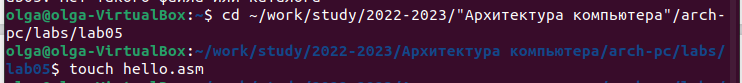{ #fig:pic1 width=100% }

Открываю созданный файл в текстовом редакторе gedit (рис. [-@fig:pic2]).

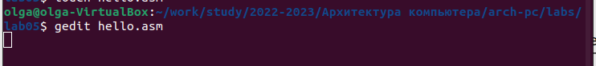{ #fig:pic2 width=100% }

Заполняю файл, вставляя в него программу для вывода "Hello world!" (рис. [-@fig:pic3]).

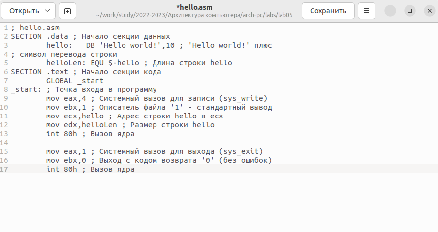{ #fig:pic3 width=100% }

## Работа с транслятором NASM

Превращаю текст программы в объектный код. Для компиляции текста программы «Hello World» использую команду nasm -f elf hello.asm. Далее проверяю правильность выполнения команды с помощью ls (рис. [-@fig:pic4]).

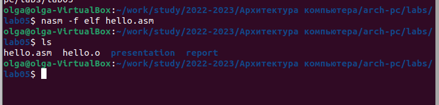{ #fig:pic4 width=100% }

## Работа с расширенным синтаксисом командной строки NASM

Ввожу команду, которая скомпилирует файл hello.asm в файл obj.o, такжу с помощью -l будет создан файл list.lst. Проверяю правильность выполнения команды с помощью ls (рис. [-@fig:pic5]).

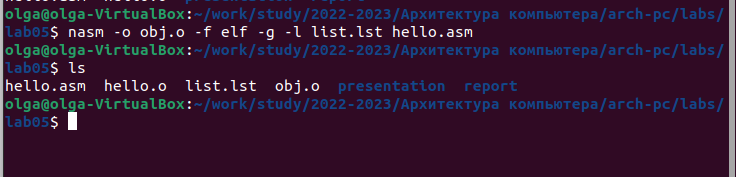{ #fig:pic5 width=100% }

## Работа с компоновщиком LD

Передаю объектный файл hello.o на обработку компоновщику LD, чтобы получить исполняемый файл hello. Проверяю правильность выполнения команды с помощью ls (рис. [-@fig:pic6]).

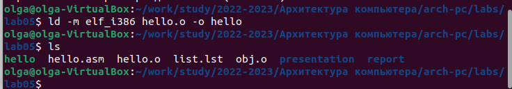{ #fig:pic6 width=100% }

Выполняю следующую команду. Объектный файл, из которого собран этот исполняемый файл, имеет имя obj.o. Проверяю правильность выполнения команды с помощью ls (рис. [-@fig:pic7]).

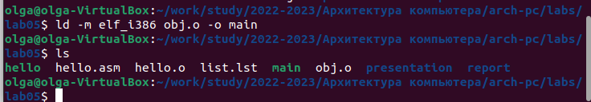{ #fig:pic7 width=100% }

## Запуск исполняемого файла

Запускаю на выполнение исполняемый файл hello (рис. [-@fig:pic8]).

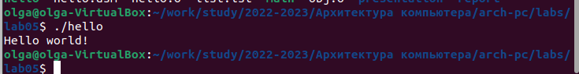{ #fig:pic8 width=100% }

# Задание для самостоятельной работы

Создаю с помощью cp копию файла hello.asm с именем lab5.asm и открываю его в текстовом редакторе gedit (рис. [-@fig:pic9]).

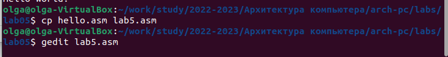{ #fig:pic9 width=100% }

Вношу в программу изменения, чтобы она выводила мои имя и фамилию. Далее компилирую текст программы в объектный файл. Проверяю правильность выполнения команды с помощью ls (рис. [-@fig:pic10]).

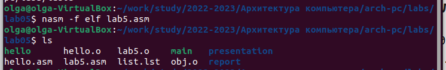{ #fig:pic10 width=100% }

Передаю объектный файл lab5.o на обработку компоновщику LD, чтобы получить исполняемый файл lab5 (рис. [-@fig:pic11]).

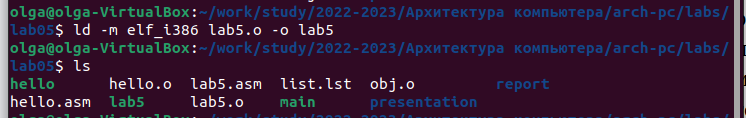{ #fig:pic11 width=100% }

Запускаю исполняемый файл (рис. [-@fig:pic12]).

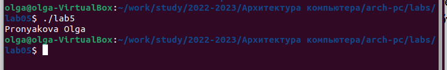{ #fig:pic12 width=100% }

Добавляем файлы на Github.

# Выводы

Освоила процедуры компиляции и сборки программ, написанных на ассемблере NASM.

# Список литературы{.unnumbered}

[1. Архитектура ЭВМ](https://esystem.rudn.ru/pluginfile.php/1584622/mod_resource/content/1/Лабораторная%20работа%20№3.pdf)

::: {#refs}
:::
