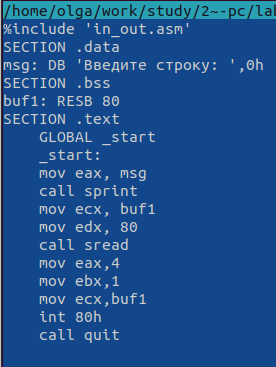

---
## Front matter
title: "Шаблон отчёта по лабораторной работе №6"
subtitle: "Дисциплина: архитектура компьютера"
author: "Пронякова Ольга Максимовна"

## Generic otions
lang: ru-RU
toc-title: "Содержание"

## Bibliography
bibliography: bib/cite.bib
csl: pandoc/csl/gost-r-7-0-5-2008-numeric.csl

## Pdf output format
toc: true # Table of contents
toc-depth: 2
lof: true # List of figures
lot: true # List of tables
fontsize: 12pt
linestretch: 1.5
papersize: a4
documentclass: scrreprt
## I18n polyglossia
polyglossia-lang:
  name: russian
  options:
	- spelling=modern
	- babelshorthands=true
polyglossia-otherlangs:
  name: english
## I18n babel
babel-lang: russian
babel-otherlangs: english
## Fonts
mainfont: PT Serif
romanfont: PT Serif
sansfont: PT Sans
monofont: PT Mono
mainfontoptions: Ligatures=TeX
romanfontoptions: Ligatures=TeX
sansfontoptions: Ligatures=TeX,Scale=MatchLowercase
monofontoptions: Scale=MatchLowercase,Scale=0.9
## Biblatex
biblatex: true
biblio-style: "gost-numeric"
biblatexoptions:
  - parentracker=true
  - backend=biber
  - hyperref=auto
  - language=auto
  - autolang=other*
  - citestyle=gost-numeric
## Pandoc-crossref LaTeX customization
figureTitle: "Рис."
tableTitle: "Таблица"
listingTitle: "Листинг"
lofTitle: "Список иллюстраций"
lotTitle: "Список таблиц"
lolTitle: "Листинги"
## Misc options
indent: true
header-includes:
  - \usepackage{indentfirst}
  - \usepackage{float} # keep figures where there are in the text
  - \floatplacement{figure}{H} # keep figures where there are in the text
---

# Цель работы

Целью данной лабораторной работы является приобретение практических навыков работы в Midnight Commander. Освоение инструкций языка ассемблера mov и int.

# Задание

1. Основы работы с mc
2. Структура программы на языке ассемблера NASM
3. Подключение внешнего файла
4. Выполнение заданий для самостоятельной работы

# Теоретическое введение

Midnight Commander (или просто mc) — это программа, которая позволяет
просматривать структуру каталогов и выполнять основные операции по управ-
лению файловой системой, т.е. mc является файловым менеджером. Midnight
Commander позволяет сделать работу с файлами более удобной и наглядной.

# Выполнение лабораторной работы

## Основы работы с mc

Открываю Midnight Commander с помощью mc (рис. [-@fig:pic1]).

{ #fig:pic1 width=100% }

Перехожу в каталог ~/work/stude/2022-2023/"Архитектура компьютера"/arch-pc (рис. [-@fig:pic2]).

{ #fig:pic2 width=100% }

С помощью функциональной клавиши F7 создаю каталог lfb06 (рис. [-@fig:pic3]).

{ #fig:pic3 width=100% }

Перехожу в созданный каталог. В строке ввода прописываю команду touch lab6-1.asm, чтобы создать файл, в которм буду работать (рис. [-@fig:pic4]) (рис. [-@fig:pic5]).

{ #fig:pic4 width=100% }

{ #fig:pic5 width=100% }

## Структура программы на языке ассемблер NASM

С помощью функциональной клавиши F4 открываю созданный файл для редактирования в редакторе nano. Ввожу в файл код программы для запроса строки у пользователя. Далее сохраняю изменения и выхожу из файла (рис. [-@fig:pic6]).

{ #fig:pic6 width=100% }

С помощью функциональной клавиши F3 открываю файл, чтобы проверить содержание программы (рис. [-@fig:pic7]).

{ #fig:pic7 width=100% }

Транслирую текст программы файла в объектный файл. Выполняю компоновку объектного файла. Запускаю исполняемый файл и с клавиатуры ввожу свои ФИО (рис. [-@fig:pic8]).

{ #fig:pic8 width=100% }

## Подключение внешнего файла

Скачиваю файл in_out.asm со страницы курса в ТУИС. Он сохранился в каталоге "Загрузки" (рис. [-@fig:pic9]). 

{ #fig:pic9 width=100% }

С помощью функциональной клавиши F5 копирую файл in_out.asm из каталога Загрузки в каталог lab06 (рис. [-@fig:pic10]).

{ #fig:pic10 width=100% }

С помощью функциональной клавиши F5 копирую файл lab6-1 в тот же каталог, но с другим именем (рис. [-@fig:pic11]).

{ #fig:pic11 width=100% }

Изменяю содержимое файла lab6-2.asm в редакторе nano, чтобы в программе использовались подпрограммы из внешнего файла in_out.asm (рис. [-@fig:pic12]).

{ #fig:pic12 width=100% }

Транслирую текст программы файла в объектный файл. Выполняю компоновку объектного файла. Запускаю исполняемый файл и с клавиатуры ввожу свои ФИО (рис. [-@fig:pic13]).

{ #fig:pic13 width=100% }

Открываю файл lab6-2.asm для редактирования в nano. Изменяю в нем подпрограмму sprintLF на sprint. Сохраняю изменения (рис. [-@fig:pic14]).

{ #fig:pic14 width=100% }

Транслирую текст программы файла в объектный файл. Выполняю компоновку объектного файла. Запускаю исполняемый файл и с клавиатуры ввожу свои ФИО (рис. [-@fig:pic15]).

{ #fig:pic15 width=100% }

Разница между первым исполняемым файлом и вторым в том, что запуск первого запрашивает ввод с новой строки, а запуск второго запрашивает ввод без переноса на следующую строчку.

## Выполнение заданий для самостоятельной работы

Создаю копию файла lab6-1.asm с именем lab6-1.2.asm (рис. [-@fig:pic16]).

{ #fig:pic16 width=100% }

С помощью функциональной клавиши F4 открываю созданный файл для редактирования. Изменяю программу так, чтобы кроме ввода приглашения и запроса ввода, она выводила вводимую пользователем строчку (рис. [-@fig:pic17]).

{ #fig:pic17 width=100% }

Транслирую текст программы файла в объектный файл. Выполняю компоновку объектного файла. Запускаю исполняемый файл и с клавиатуры ввожу свои ФИО (рис. [-@fig:pic18]).

{ #fig:pic18 width=100% }

Создаю копию файла lab6-2.asm с именем lab6-2.2.asm (рис. [-@fig:pic19]).

{ #fig:pic19 width=100% }

С помощью функциональной клавиши F4 открываю созданный файл для редактирования. Изменяю программу так, чтобы кроме ввода приглашения и запроса ввода, она выводила вводимую пользователем строчку (рис. [-@fig:pic20]).

{ #fig:pic20 width=100% }

Транслирую текст программы файла в объектный файл. Выполняю компоновку объектного файла. Запускаю исполняемый файл и с клавиатуры ввожу свои ФИО (рис. [-@fig:pic21]).

{ #fig:pic21 width=100% }

# Выводы

Я приобрела практические навыки в Midnight Commander и освоила инструкции языка ассемблера mov и int.

# Список литературы{.unnumbered}

[1. Архитектура ЭВМ](https://esystem.rudn.ru/pluginfile.php/1584622/mod_resource/content/1/Лабораторная%20работа%20№3.pdf)

::: {#refs}
:::
