---
## Front matter
title: "Шаблон отчёта по лабораторной работе №7"
subtitle: "Дисциплина: архитектура компьютера"
author: "Пронякова Ольга Максимовна"

## Generic otions
lang: ru-RU
toc-title: "Содержание"

## Bibliography
bibliography: bib/cite.bib
csl: pandoc/csl/gost-r-7-0-5-2008-numeric.csl

## Pdf output format
toc: true # Table of contents
toc-depth: 2
lof: true # List of figures
lot: true # List of tables
fontsize: 12pt
linestretch: 1.5
papersize: a4
documentclass: scrreprt
## I18n polyglossia
polyglossia-lang:
  name: russian
  options:
	- spelling=modern
	- babelshorthands=true
polyglossia-otherlangs:
  name: english
## I18n babel
babel-lang: russian
babel-otherlangs: english
## Fonts
mainfont: PT Serif
romanfont: PT Serif
sansfont: PT Sans
monofont: PT Mono
mainfontoptions: Ligatures=TeX
romanfontoptions: Ligatures=TeX
sansfontoptions: Ligatures=TeX,Scale=MatchLowercase
monofontoptions: Scale=MatchLowercase,Scale=0.9
## Biblatex
biblatex: true
biblio-style: "gost-numeric"
biblatexoptions:
  - parentracker=true
  - backend=biber
  - hyperref=auto
  - language=auto
  - autolang=other*
  - citestyle=gost-numeric
## Pandoc-crossref LaTeX customization
figureTitle: "Рис."
tableTitle: "Таблица"
listingTitle: "Листинг"
lofTitle: "Список иллюстраций"
lotTitle: "Список таблиц"
lolTitle: "Листинги"
## Misc options
indent: true
header-includes:
  - \usepackage{indentfirst}
  - \usepackage{float} # keep figures where there are in the text
  - \floatplacement{figure}{H} # keep figures where there are in the text
---

# Цель работы

Освоение арифметических инструкций языка ассемблера NASM.

# Задание

1. Символьные и численные данные в NASM
2. Выполнение арифметических операций в NASM
3. Ответы на вопросы по программе
4. Выполнение заданий для самостоятельной работы

# Теоретическое введение

Большинство инструкций на языке ассемблера требуют обработки операндов.
Адрес операнда предоставляет место, где хранятся данные, подлежащие обра-
ботке. Это могут быть данные хранящиеся в регистре или в ячейке памяти. Далее
рассмотрены все существующие способы задания адреса хранения операндов –
способы адресации.
Существует три основных способа адресации:
• Регистровая адресация – операнды хранятся в регистрах и в команде
используются имена этих регистров, например: mov ax,bx.
• Непосредственная адресация – значение операнда задается непосред-
ственно в команде, Например: mov ax,2.
• Адресация памяти – операнд задает адрес в памяти. В команде указывает-
ся символическое обозначение ячейки памяти, над содержимым которой
требуется выполнить операцию.
Ввод информации с клавиатуры и вывод её на экран осуществляется в сим-
вольном виде. Кодирование этой информации производится согласно кодовой таблице символов ASCII. ASCII – сокращение от American Standard Code for
Information Interchange (Американский стандартный код для обмена информа-
цией). Согласно стандарту ASCII каждый символ кодируется одним байтом.
Расширенная таблица ASCII состоит из двух частей. Первая (символы с кода-
ми 0-127) является универсальной (см. Приложение.), а вторая (коды 128-255)
предназначена для специальных символов и букв национальных алфавитов и
на компьютерах разных типов может меняться.
Среди инструкций NASM нет такой, которая выводит числа (не в символьном
виде). Поэтому, например, чтобы вывести число, надо предварительно преоб-
разовать его цифры в ASCII-коды этих цифр и выводить на экран эти коды, а
не само число. Если же выводить число на экран непосредственно, то экран
воспримет его не как число, а как последовательность ASCII-символов – каждый
байт числа будет воспринят как один ASCII-символ – и выведет на экран эти
символы.
Аналогичная ситуация происходит и при вводе данных с клавиатуры. Вве-
денные данные будут представлять собой символы, что сделает невозможным
получение корректного результата при выполнении над ними арифметических
операций.
Для решения этой проблемы необходимо проводить преобразование ASCII
символов в числа и обратно.
Для выполнения лабораторных работ в файле in_out.asm реализованы под-
программы для преобразования ASCII символов в числа и обратно. Это:
• iprint – вывод на экран чисел в формате ASCII, перед вызовом iprint в
регистр eax необходимо записать выводимое число (mov eax,<int>).
• iprintLF – работает аналогично iprint, но при выводе на экран после
числа добавляет к символ перевода строки.
• atoi – функция преобразует ascii-код символа в целое число и записает
результат в регистр eax, перед вызовом atoi в регистр eax необходимо
записать число (mov eax,<int>).

# Выполнение лабораторной работы

## Символьные и численные данные в NASM

С помощью mkdir создаю директорию, в которой буду создавать файлы с программами для лабораторной работы №7 (рис. [-@fig:pic1]).

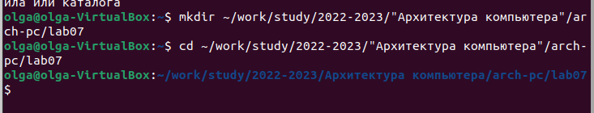{ #fig:pic1 width=100% }

С помощью touch создаю файл lab7-1.asm (рис. [-@fig:pic2]).

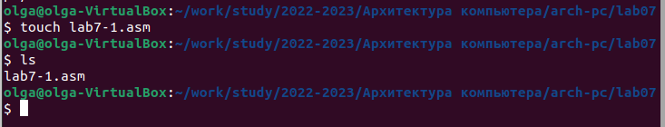{ #fig:pic2 width=100% }

С помощью cp копирую в текущий каталог файл in_out.asm, так как он будет использоваться в других программах (рис. [-@fig:pic3]).

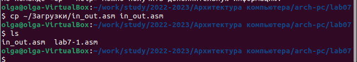{ #fig:pic3 width=100% }

Открываю файл lab7-1.asm и вставляю в него программу вывода значения регистра eax (рис. [-@fig:pic4]).

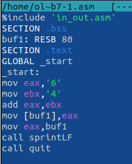{ #fig:pic4 width=100% }

Транслирую текст программы файла в объектный файл. Выполняю компоновку объектного файла. Программа выводит j, потому что программа вывела символ, соответствующий по системе ASCII сумме двоичных кодов символов 4 и 6 (рис. [-@fig:pic5]).

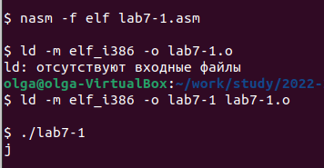{ #fig:pic5 width=100% }

Изменяю в программе символы "6" и "4" на цифры 6 и 4 (рис. [-@fig:pic6]).

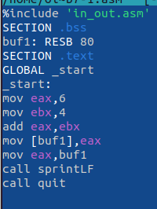{ #fig:pic6 width=100% }

Транслирую текст программы файла в объектный файл. Выполняю компоновку объектного файла. Теперь программа выводит символ с кодом 10, символ перевода строки, он не отображается при выводе на экран (рис. [-@fig:pic7]).

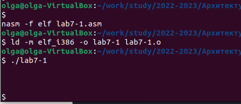{ #fig:pic7 width=100% }

С помощью touch создаю файл lab7-2.asm (рис. [-@fig:pic8]).

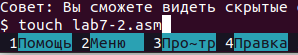{ #fig:pic8 width=100% }

Ввожу в файл текст другой программы для вывода значения регистра eax (рис. [-@fig:pic9]).

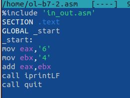{ #fig:pic9 width=100% }

Транслирую текст программы файла в объектный файл. Выполняю компоновку объектного файла. Теперь выводит число 106, потому что программа позволяет вывести именно число, а не символ (рис. [-@fig:pic10]).

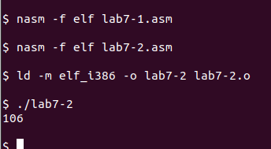{ #fig:pic10 width=100% }

Изменяю в программе символы "6" и "4" на цифры 6 и 4 (рис. [-@fig:pic11]).

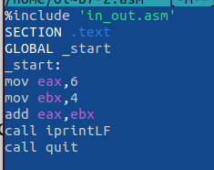{ #fig:pic11 width=100% }

Транслирую текст программы файла в объектный файл. Выполняю компоновку объектного файла. Теперь программа складывает не соответствующие символам коды в системе ASCII, а сами числа, поэтому выводит 10 (рис. [-@fig:pic12]).

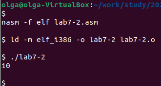{ #fig:pic12 width=100% }

Заменяю в тексте программы функцию iprintLF на iprint (рис. [-@fig:pic13]).

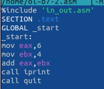{ #fig:pic13 width=100% }

Транслирую текст программы файла в объектный файл. Выполняю компоновку объектного файла. Вывод не изменился, так как символ переноса строки не отобразился, когда программа исполнялась с функцией iprintLF, а iprint не доюавляет к выводу символ переноса строки (рис. [-@fig:pic14]).

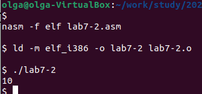{ #fig:pic14 width=100% }

## Выполнение арифметических операций в NASM

С помощью touch создаю файл lab7-3.asm (рис. [-@fig:pic15]).

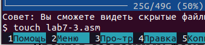{ #fig:pic15 width=100% }

Ввожу в файл текст программы для вычисления значения выражения f(x) = (5 * 2 + 3)/3 (рис. [-@fig:pic16]).

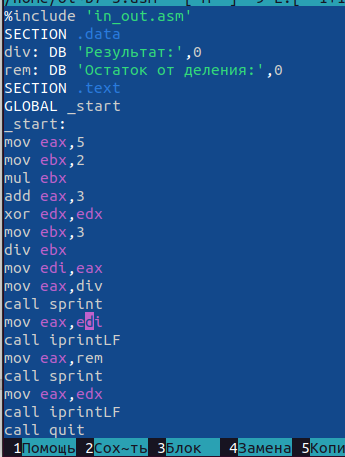{ #fig:pic16 width=100% }

Транслирую текст программы файла в объектный файл. Выполняю компоновку объектного файла (рис. [-@fig:pic17]).

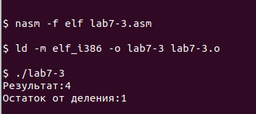{ #fig:pic17 width=100% }

Изменяю программу так, чтобы она вычисляла выражение f(x) = (4 * 6 + 2)/5 (рис. [-@fig:pic18]).

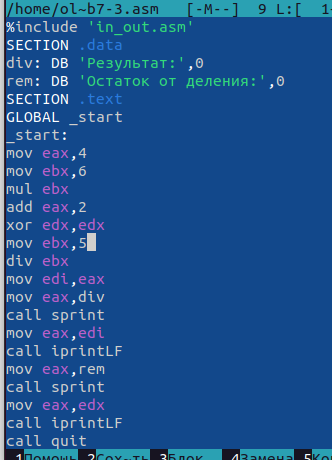{ #fig:pic18 width=100% }

Транслирую текст программы файла в объектный файл. Выполняю компоновку объектного файла (рис. [-@fig:pic19]).

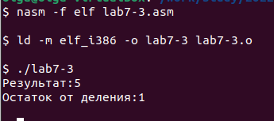{ #fig:pic19 width=100% }

С помощью touch создаю файл variant.asm (рис. [-@fig:pic20]).

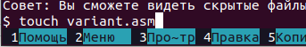{ #fig:pic20 width=100% }

Ввожу в файл текст программы для вычисления варианта задания по номеру студенческого билета (рис. [-@fig:pic21]).

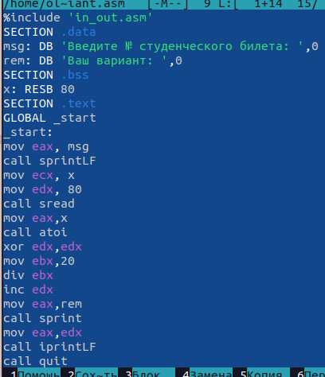{ #fig:pic21 width=100% }

Транслирую текст программы файла в объектный файл. Выполняю компоновку объектного файла. Ввожу номер студенческого билета, программа вывела мой вариант-14 (рис. [-@fig:pic22]).

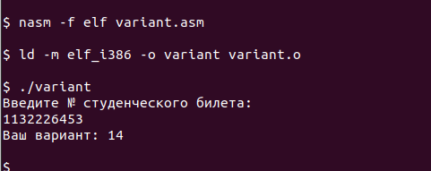{ #fig:pic22 width=100% }

## Ответы на вопросы по программе

1. За вывод сообщения "Ваш вариант" отвечают строки: 
mov eax,rem
call sprint

2. mov ecx - положить адрес вводимой строки x в регистр ecx 
mov edx,80 - запись а регистр edx длины вводимой строки 
call sread - вызов подпрограммы из внешнего файла, обеспечивающий ввод сообщения с клавиатуры

3. call atoi - вызов подпрограммы тз внешнего файла, которая преобразует ASCII-код символа в целое число и записывает результат в регистр eax

4. За вычисления варианта отвечают строки:
xor edx,edx
mov ebx,20
div ebx
inc edx

5. При выполнении инструкции div ebx остаток от деления записывется в регистр edx

6. Инструкция inc edx увеличивает значение регистра edx на 1

7. За вывод результатов вычислений отвечают строки:
mov eax,edx
call iprintLF

## Выполнение заданий для самостоятельной работы

С помощью touch создаю файл lab7-4.asm (рис. [-@fig:pic23]).

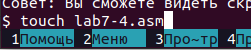{ #fig:pic23 width=100% }

Открываю файл и ввожу в него текст программы для вычисления значения выражения 14 варианта (x/2 + 8) * 3 (рис. [-@fig:pic24]).

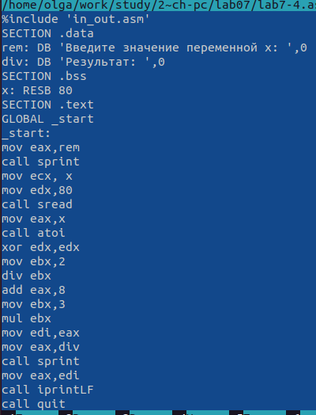{ #fig:pic24 width=100% }

Транслирую текст программы файла в объектный файл. Выполняю компоновку объектного файла (рис. [-@fig:pic25]).

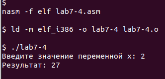{ #fig:pic25 width=100% }

# Выводы

Я освоила арифметические инструкции языка ассемблера NASM.

# Список литературы{.unnumbered}

[1. Архитектура ЭВМ](https://esystem.rudn.ru/pluginfile.php/1584622/mod_resource/content/1/Лабораторная%20работа%20№3.pdf)

::: {#refs}
:::
